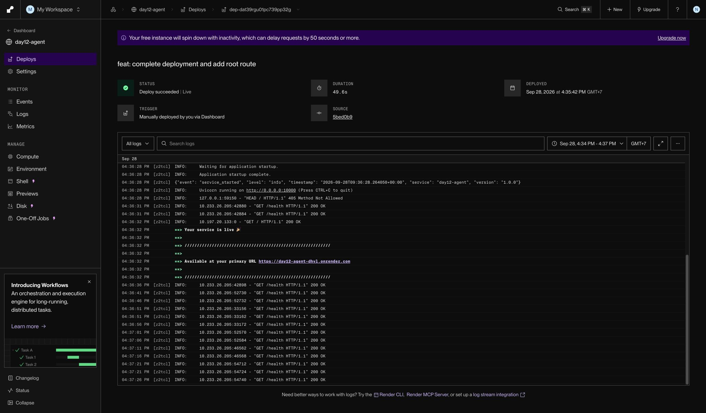
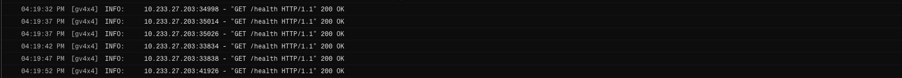

# Thông Tin Deploy — Checkpoint 5

> `pytest tests/test_cp5.py` đọc Public URL trong file này để kiểm tra service.
>
> **Chỉ ghi TÊN biến môi trường, tuyệt đối không dán giá trị API key vào đây.**
> Repo này công khai — dán khóa vào là mất khóa.

## Thông Tin Học Viên

| Mục | Nội dung |
|-----|----------|
| Họ và tên | Nguyễn Nam Khánh |
| Mã học viên | 2A202602568 |
| Repo | https://github.com/KanaxNguyen/K4-L3A-DAY12-NguyenNamKhanh-2A202602568-CloudServicesAndDeployment |

## Service

| Mục | Nội dung |
|-----|----------|
| Public URL | https://day12-agent-dhvl.onrender.com |
| Platform | Render |
| Ngày deploy | 2026-09-28 |
| Render Dashboard | https://dashboard.render.com/web/srv-dat2hrg473hc73efm2u0 |
| Deploy và log | [Deploy ngày 28/09/2026 lúc 16:18:30 GMT+7](https://dashboard.render.com/web/srv-dat2hrg473hc73efm2u0/deploys/dep-dat31ph7lnhs73bevp40?r=2026-09-28%4009%3A17%3A30%7E2026-09-28%4009%3A19%3A58) |
| Deploy mới nhất | [Deploy ngày 28/09/2026 lúc 16:35:42 GMT+7](https://dashboard.render.com/web/srv-dat2hrg473hc73efm2u0/deploys/dep-dat39rgu01pc739pp32g?r=2026-09-28%4009%3A34%3A42%7E2026-09-28%4009%3A37%3A32) |
| Commit được deploy | [5bed0b9](https://github.com/KanaxNguyen/K4-L3A-DAY12-NguyenNamKhanh-2A202602568-CloudServicesAndDeployment/commit/5bed0b95144cb3c37e5f5d01fd9972c2ea0662a9) |
| Health | https://day12-agent-dhvl.onrender.com/health |
| Readiness | https://day12-agent-dhvl.onrender.com/ready |
| Swagger API | https://day12-agent-dhvl.onrender.com/docs |
| Environment | https://dashboard.render.com/web/srv-dat2hrg473hc73efm2u0/env |

Dashboard và log yêu cầu đăng nhập tài khoản Render có quyền truy cập service.

## Biến Môi Trường Đã Set Trên Cloud

Ghi tên biến và **nguồn giá trị**, không ghi giá trị:

| Biến | Đã set | Ghi chú |
|------|--------|---------|
| `PORT` | ✅ | platform tự gán |
| `AGENT_API_KEY` | ✅ | Đã đặt trên Render; test gửi khóa cục bộ được chấp nhận |
| `REDIS_URL` | ✅ | Render Key Value (day12-redis connectionString) |
| `RATE_LIMIT_PER_MINUTE` | ✅ | 10 |
| `MONTHLY_BUDGET_USD` | ✅ | 10.0 |
| `LOG_LEVEL` | ✅ | INFO |

## Lệnh Kiểm Tra

Các lệnh dưới đây dùng Public URL thật. Với lệnh cần xác thực, đặt
`AGENT_API_KEY` trong môi trường shell bằng khóa đã lưu trên Render, không
ghi khóa vào tài liệu. Khi chạy pytest, dùng `DEPLOY_API_KEY` trong `.env`
cục bộ với cùng giá trị. Test dùng `DEPLOY_API_KEY` vì `AGENT_API_KEY` được
fixture thay bằng khóa giả phục vụ unit test.

```bash
# 1. Liveness — mong đợi 200 {"status":"ok"}
curl -i https://day12-agent-dhvl.onrender.com/health

# 2. Readiness — mong đợi 200 {"status":"ready"} (đã nối được Redis)
curl -i https://day12-agent-dhvl.onrender.com/ready

# 3. Không có API key — mong đợi 401
curl -i -X POST https://day12-agent-dhvl.onrender.com/ask \
  -H "Content-Type: application/json" \
  -d '{"question":"Hello"}'

# 4. Có API key — mong đợi 200 kèm câu trả lời
curl -i -X POST https://day12-agent-dhvl.onrender.com/ask \
  -H "Content-Type: application/json" \
  -H "X-API-Key: $AGENT_API_KEY" \
  -H "X-User-Id: sv-test" \
  -d '{"question":"Deploy là gì?"}'

# 5. Rate limit — user riêng để không bị ảnh hưởng bởi lệnh #4
RATE_TEST_USER="cp5-rate-$(date +%s)"
for i in $(seq 1 15); do
  curl -s -o /dev/null -w "%{http_code} " -X POST https://day12-agent-dhvl.onrender.com/ask \
    -H "Content-Type: application/json" \
    -H "X-API-Key: $AGENT_API_KEY" \
    -H "X-User-Id: $RATE_TEST_USER" \
    -d '{"question":"test"}'
done; echo
```

## Kết Quả Chạy Thật

Kiểm tra ngày 28/09/2026 trên URL HTTPS công khai. Render báo
`Deploy succeeded | Live`. `/health`, `/ready` và xác thực khi thiếu khóa đã
đạt yêu cầu. Test `/ask` có khóa cũng đã trả 200 và có câu trả lời.
Bộ test CP5 đã chạy thành công.

```text
# 1. GET /health
HTTP 200 — test xác nhận status = ok

# 2. GET /ready
HTTP 200 — đã kết nối được Redis trên cloud

# 3. POST /ask (không có API key)
HTTP 401 — đúng yêu cầu

# 4. POST /ask (có API key)
HTTP 200 — test xác nhận có câu trả lời

# 5. Rate limit (15 requests)
Chưa kiểm tra lại vòng curl 15 request; không thuộc bộ test CP5.

# .venv/bin/python -m pytest tests/test_cp5.py -v --tb=short
9 passed, 4 skipped in 2.18s
```

4 test bị bỏ qua thuộc phương án `LOCAL_FALLBACK`; bài này dùng Render thật.

## Lỗi Deploy Và Cách Xử Lý

Log của bản deploy ghi:

```text
pydantic_core._pydantic_core.ValidationError: 1 validation error for Settings
agent_api_key
Field required [type=missing]
```

`/health` độc lập với Redis và cấu hình xác thực nên vẫn trả 200.
`/ready` và `/ask` cần `Settings`, do đó thiếu khóa bắt buộc đã gây HTTP 500
trước khi kiểm tra Redis hoặc xác thực request. Trang Environment xác nhận
có `REDIS_URL`, `LOG_LEVEL`, `RATE_LIMIT_PER_MINUTE`, `MONTHLY_BUDGET_USD`,
nhưng lúc kiểm tra đầu tiên chưa có `AGENT_API_KEY`.

Sau khi thêm tên biến nhưng để Value trống, `/ready` trả 200, `/ask` không
có khóa trả 401, nhưng `/ask` gửi khóa cục bộ vẫn trả 401. Sau khi nhập giá
trị khóa thật và deploy lại, test xác thực thành công: `/ask` gửi
`DEPLOY_API_KEY` cục bộ trả 200 và có câu trả lời.

Cách khắc phục đã áp dụng: nhập Value cho `AGENT_API_KEY` trong Render Environment bằng khóa đã
lưu cục bộ ở `DEPLOY_API_KEY`, chọn **Save, rebuild, and deploy**, chờ deploy
thành công rồi chạy lại bộ test. Redis đã được xác nhận hoạt động qua
test `/ready` trả 200.

Render cấp `PORT` lúc chạy; Dockerfile truyền `${PORT:-8000}` cho Uvicorn
và bind `0.0.0.0`. Secret nằm trong Environment trên Render; `.env` cục bộ
được Git bỏ qua. Cấu hình Blueprint nằm trong [render.yaml](render.yaml).

## Ảnh Chụp Màn Hình

Đặt ảnh trong thư mục `screenshots/`:

- [Dashboard Render](screenshots/dashboard.png) — bản deploy mới nhất thành công,
  Uvicorn chạy trên `0.0.0.0:10000` và `/health` trả 200.
- [Log health](screenshots/health.png) — ảnh chụp phần log Render ghi
  `GET /health HTTP/1.1` trả `200 OK`. Đây là ảnh log phía server; chưa có
  ảnh response trực tiếp từ trình duyệt/curl vì trình duyệt tự động chặn
  mở trang `/health` với lỗi `ERR_BLOCKED_BY_CLIENT`.




